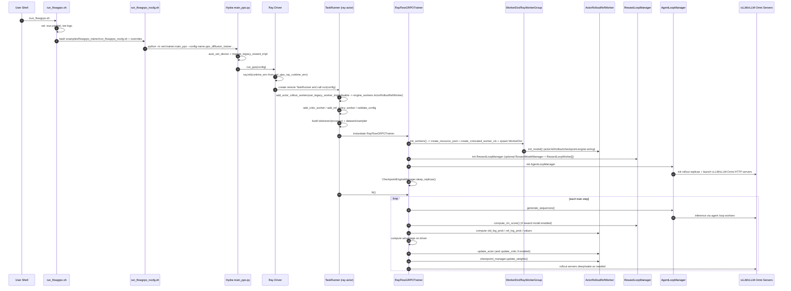
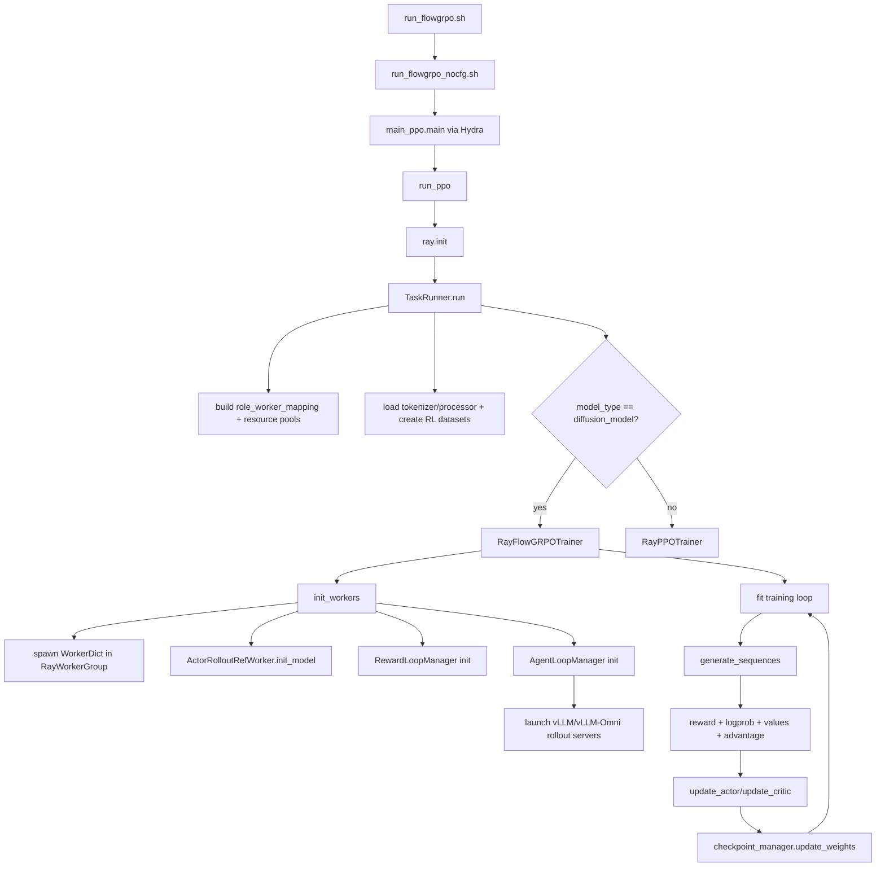

# FlowGRPO Execution Flow (for `./run_flowgrpo.sh`)

## Scope
This diagram describes the actual runtime path triggered by:
- `/workspace/verl/run_flowgrpo.sh`
- `/workspace/verl/examples/flowgrpo_trainer/run_flowgrpo_nocfg.sh`
- `python3 -m verl.trainer.main_ppo --config-name ppo_diffusion_trainer ...`

It focuses on the FlowGRPO diffusion path (`RayFlowGRPOTrainer`), Ray actor orchestration, rollout/reward/agent-loop startup, and the per-step training loop.

## 1) Startup Sequence Diagram

## 2) Control-Flow Graph (condensed)

## 3) Important Runtime Details (from this path)
- `run_flowgrpo.sh` only forwards overrides; real default bundle lives in `examples/flowgrpo_trainer/run_flowgrpo_nocfg.sh`.
- `run_flowgrpo_nocfg.sh` ends with `$@`, so values passed from `run_flowgrpo.sh` override earlier defaults if duplicated.
- `main_ppo.py` selects trainer class by `config.actor_rollout_ref.model.model_type`:
  - `diffusion_model` -> `RayFlowGRPOTrainer`
  - otherwise -> `RayPPOTrainer`
- Worker colocation is done by `create_colocated_worker_cls(...)`, which builds a `WorkerDict` wrapper and binds registered methods of inner workers.

## 4) Key Source Anchors
- Entry scripts:
  - `/workspace/verl/run_flowgrpo.sh`
  - `/workspace/verl/examples/flowgrpo_trainer/run_flowgrpo_nocfg.sh`
- Main entry and task runner:
  - `/workspace/verl/verl/trainer/main_ppo.py`
- FlowGRPO trainer lifecycle:
  - `/workspace/verl/verl/trainer/ppo/ray_diffusion_trainer.py`
- Colocated WorkerDict generation:
  - `/workspace/verl/verl/single_controller/ray/base.py`
- Engine worker init/update:
  - `/workspace/verl/verl/workers/engine_workers.py`
- Reward loop and reward model server manager:
  - `/workspace/verl/verl/experimental/reward_loop/reward_loop.py`
  - `/workspace/verl/verl/experimental/reward_loop/reward_model.py`
- Agent loop and rollout server launching:
  - `/workspace/verl/verl/experimental/agent_loop/agent_loop.py`
  - `/workspace/verl/verl/workers/rollout/replica.py`
  - `/workspace/verl/verl/workers/rollout/vllm_rollout/vllm_omni_async_server.py`
